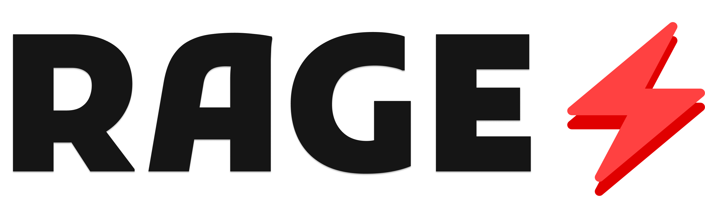

<br>

<div align='center'>
  <picture>
    <source media="(prefers-color-scheme: dark)" srcset="./img_for_docs/RAGE-default.png">
    
  </picture>
</div>

<div align='center'>

#### A Data Management Approach for Offline-First Applications

</div>
<br>

<div align='center'>


</div>

<br>

## The RAGE Approach

"**RAGE**" is a data management approach that enables offline-first applications by caching data locally in JSON files. It connects to your MongoDB, Firebase, or other no-sql databases, retrieves the data, and stores it locally in a JSON format.

With RAGE, you can perform CRUD operations on the local JSON files, and in the background, RAGE will synchronize the changes with your remote database at regular intervals. This approach improves application performance, provides offline support, and reduces the load on your remote database.

**Key Benefits:**

- Improved application performance
- Offline support
- Reduced load on remote databases
- Easy data synchronization

## RAGE.js

"**RAGE.js**" however, is the implementation of the RAGE approach, providing tools to use RAGE approach efficiently.

## RAGE Methods

Even if the approach works, you can still customize the behavior of what to do in the middle of the instance, etc with these three primary methods:

1. [Push After Interval (PAI)](#push-after-interval)
2. [Push On Update (POU)](#push-on-update)
3. [No Interval (NI)](#no-interval)

### Push After Interval

In the middle of the instance, it will push the local JSON files' data to the cloud databases of your choice after every certain interval given by the user. This is the most efficient way compared to the other methods.

> [!NOTE]
> The loop that runs to synochronize the cloud database is called as the **"RAGE main loop"**

### Push On Update

This method will make the application push on every update that occurs on the local files. This is the most less efficient way compared to the other methods but it still can be used in certain cases.

### No Interval

This method does not perform any task at the middle of the instance, except for synchronizing the changes on local JSON data with the the cloud database of your choice at the end of the instance, just like every other method.

You can set the method of your choice when creating your application through `npx rage` as well. OR if you want to change the method explictly, you can change your `rage.config.json` file like this:

```json
{
  ...
  "method": "PAI", // PAI | POU | NI
  "methodSpecificSettings": {
    ...
  }
}
```

where `methodSpecificSettings` depends upon your method, if you are using `PAI` method, then you should include `interval` _(The amount of interval for synochronizing the local data with the cloud database of your choice)_ and 600000ms or 10min is the minimum interval, you can extend from there.

> [!WARNING]
> Setting the interval is important, as the higher the better, but also too much high like 5hrs or more than that is too much! You can it keep moderate like 2-3hrs for production use and around 10-20min for testing and development purposes.

##### rage.config.json

<br>
<br>

<div align="center">

_Thank you all for the love and support_

_Made with 💢 and Node.js_

</div>
